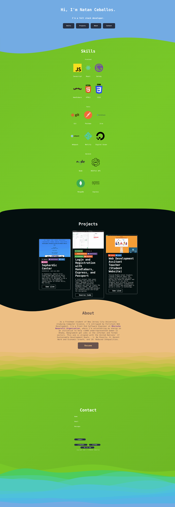

<div id="top"></div
<!-- PROJECT SHIELDS -->


<!--
*** I'm using markdown "reference style" links for readability.
*** Reference links are enclosed in brackets [ ] instead of parentheses ( ).
*** See the bottom of this document for the declaration of the reference variables
*** for contributors-url, forks-url, etc. This is an optional, concise syntax you may use.
*** https://www.markdownguide.org/basic-syntax/#reference-style-links
-->

<!-- PROJECT LOGO -->
<br />
<div align="center">

  <a href="https://github.com/NatC02/portfolio">
    
    
    
    
  </a>

  <h3 align="center">Gatsby Portfolio </h3>

  <p align="center">
    A single page Gatsby portfolio website deployed on Netlify
  </p>
</div>

<!-- TABLE OF CONTENTS -->
<details>
  <summary>Table of Contents</summary>
  <ol>
    <li>
      <a href="#about-the-project">About The Project</a>
      <ul>
        <li><a href="#usage">Usage</a></li>
        <li><a href="#built-with">Built With</a></li>
        <li><a href="#app-structure">App Structure</a></li>
      </ul>
    </li>
    <li>
      <a href="#getting-started">Getting Started</a>
      <ul>
        <li><a href="#installation">Installation</a></li>
        <li><a href="#deploy">Deployment</a></li>
      </ul>
    </li>
    <li><a href="#acknowledgments">Acknowledgments</a></li>
  </ol>
</details>

<!-- ABOUT THE PROJECT -->

## About The Project



Built with and implemented with the following in mind:

- Gatsby naturally follows the [PRPL architerual pattern](https://web.dev/apply-instant-loading-with-prpl/)
    <!-- 
    - Push (or preload) the most important resources. - Gatsby does this naturally.
    - Render the initial route as soon as possible. - Really straight forward. This is a Single page site so it's not very applicable atleast because it doesn't have more than one page.
    - Pre-cache remaining routes. - Gatsby again deals with this when your ready build and deploy.
    - Lazy-load and create remaining routes on demand. - Self-explanatory if you've worked with React before and implemented lazy load, tree shaking, or conditional rendering. 
    -->
- Animate CSS animation library
- CSS Grid & CSS Flexbox - Element layout / placement
- Netlify - For fast deployment

<p align="right">(<a href="#top">back to top</a>)</p>

<!-- USAGE EXAMPLES -->

## Usage


### Built with

- [Gatsby](https://www.gatsbyjs.com/)
- [Animate CSS](https://animate.style/)
- [CSS Grid](https://css-tricks.com/snippets/css/complete-guide-grid/)
- [Netlify](https://app.netlify.com/)

<p align="right">(<a href="#top">back to top</a>)</p>

## App structure

```
├── .cache
├── node_modules
├── public
├── src
│   ├── assets
│   │   ├── document
│   │   ├── gifs
│   │   ├── icons
│   │   ├── images
│   │   ├── imagesReadMe
│   │   └── scss
│   ├── components
│   │   ├── About.js
│   │   ├── Blog.js
│   │   ├── Contact.js
│   │   ├── Footer.js
│   │   ├── Header.js
│   │   ├── layout.js
│   │   ├── Project.js
│   │   └── Skills.js
│   ├── pages
│   │   ├── 404.js
│   │   └── index.js  
├── gatsby-config.js
├── package-lock.json
├── package.json
└── README.md
```

<p align="right">(<a href="#top">back to top</a>)</p>

<!-- GETTING STARTED -->
## Getting Started

To get a local copy up and running follow these simple steps.

### Installation

1. Clone the repo
   ```sh
   git clone https://github.com/NatC02/portfolio
   ```
2. Install npm packages
   ```sh
   npm install
   ```
3. Start developing 
   ```sh
   gatsby develop
   ```
4. Build the public folder for deployment 
   ```sh
   gatsby build
   ```

## Deploy

By doing the following:

1. Create your Netlify account [Here](https://app.netlify.com/)

2. Drag and drop your public folder

3. Deployed! (Follow the Netlify instructions on the same page for Custom Domain and)
 
4. To receive form updates click on the form tab

<p align="right">(<a href="#top">back to top</a>)</p>

<!-- CONTRIBUTING -->

## Acknowledgments

Some of the resources I used or read while building this portfolio.

### Resources

- [Color Palettes](https://mycolor.space/?hex=%23FBD82F&sub=1)
- [SVG Simple](https://www.shapedivider.app/) || [SVG Customization](https://app.haikei.app/)
- [Color Scheme](https://coolors.co/)
- [Color Picker from Image](https://imagecolorpicker.com/)
- [Color Palette Combinations](https://seochecker.it/color-palette-generator)
- [HEX to HSL](https://htmlcolors.com/hex-to-hsl)
- [Custom Domain Setup](https://medium.com/learnaws/route-domain-in-aws-route53-to-netlify-webapp-4891e39e5051)

### Theory

- [60 30 10 Rule](https://www.flowmapp.com/blog/glossary-term/60-30-10-rule)
- [Golden Ratio](https://www.invisionapp.com/inside-design/golden-ratio-designers/)

<p align="right">(<a href="#top">back to top</a>)</p>
